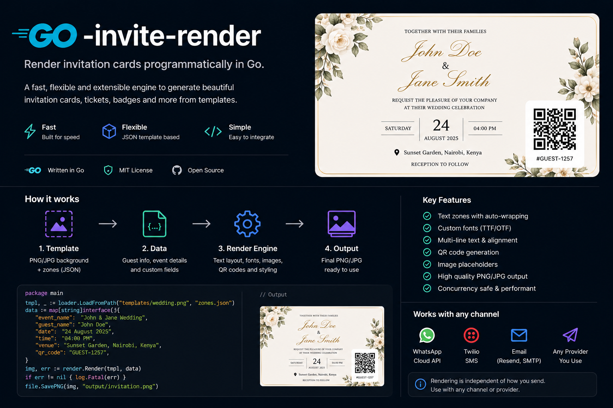

<div align="center">
  
</div>

<div align="center">

[](https://pkg.go.dev/github.com/godopetza/go-invite-render)
[](https://goreportcard.com/report/github.com/godopetza/go-invite-render)
[](LICENSE)

</div>

---

Server-side event invitation card generator for Go.

Input: background image + zone definitions + guest fields.  
Output: PNG bytes.

No login, no database, no external services. Fonts are bundled. Think of it as Photoshop automation — you define where text, images, and QR codes go; the library composites them.

## Install

```
go get github.com/godopetza/go-invite-render
```

## Quick start

```go
import inviterender "github.com/godopetza/go-invite-render"

bg, _ := os.ReadFile("template.png")

zones := []inviterender.Zone{
    {
        ID:         "guest_name",
        Type:       "text",
        Text:       "{{guest_name}}",
        XPct:       50, YPct: 42,
        WidthPct:   80,
        FontFamily: "Cormorant Garamond",
        FontSize:   48,
        Color:      "#ffffff",
        Bold:       true,
        Align:      "center",
    },
    {
        ID:         "event_date",
        Type:       "text",
        Text:       "{{event_date}}",
        XPct:       50, YPct: 55,
        WidthPct:   60,
        FontFamily: "Montserrat",
        FontSize:   24,
        Color:      "#f0e6c8",
        Align:      "center",
    },
    inviterender.DefaultQRZone(), // bottom-right, auto-renders {{__checkin_token__}}
}

png, err := inviterender.RenderCard(bg, zones, map[string]string{
    "guest_name":       "Amina & Baraka",
    "event_date":       "Saturday, 14 June 2025",
    "__checkin_token__": "EVT1-GUEST42-ABC123",
})
```

## Zone types

### `text`
Renders a text string with HarfBuzz OpenType shaping (ligatures, kerning). Supports word-wrap within `WidthPct`.

| Field | Type | Description |
|---|---|---|
| `Text` | string | Content, supports `{{token}}` substitution |
| `FontFamily` | string | One of the bundled families (see below) |
| `FontSize` | float64 | Points |
| `Color` | string | `#rrggbb` or `#rrggbbaa` |
| `Bold`, `Italic`, `Underline` | bool | Style flags |
| `Align` | string | `left`, `center`, `right` |
| `Opacity` | float64 | 0.0–1.0, default 1.0 |

### `image`
Composites a source image (URL or data URI) into a shaped frame, cover-fit with optional pan/zoom.

| Field | Type | Description |
|---|---|---|
| `ImageSrc` | string | HTTP URL or `data:image/...;base64,...` |
| `FrameShape` | string | `circle`, `oval`, `heart`, `arch`, `diamond`, `hexagon`, `none` |
| `FrameColor` | string | Decorative ring color, `#rrggbb` |
| `ImageOffsetX`, `ImageOffsetY` | float64 | Pan offset in pixels |
| `ImageScale` | float64 | Zoom multiplier (1.0 = fit, >1 = zoom in) |

### `qr`
Renders a QR code for the value of `{{__checkin_token__}}` in the fields map.

Use `inviterender.DefaultQRZone()` for a standard bottom-right placement, or configure your own:

```go
Zone{
    ID:        "checkin_qr",
    Type:      "qr",
    XPct:      85, YPct: 88,
    WidthPct:  18, HeightPct: 18,
}
```

## Zone positioning

All positions and sizes are **percentage of card width/height**, so the output resolution doesn't affect layout.

The internal render height is fixed at 1100px; width scales proportionally from the background image's aspect ratio.

`XPct`/`YPct` is the **center** of the zone.

## Token substitution

Any zone's `Text` field can contain `{{token}}` placeholders. Pass the values in the `fields` map:

```go
fields := map[string]string{
    "guest_name":        "Amina & Baraka",
    "event_title":       "Our Wedding",
    "__checkin_token__": "EVT1-GUEST42-ABC123",
}
```

`__checkin_token__` is special — if present and non-empty, any `qr` zone renders it as a QR code.

## Bundled fonts

| Family | Styles |
|---|---|
| Cormorant Garamond | Regular, Bold, Italic, Bold Italic |
| Playfair Display | Regular, Bold, Italic |
| Montserrat | Regular, Bold, Italic |
| Great Vibes | Regular |

Pass the family name exactly as shown above to `FontFamily`.

## Use as a microservice

You don't have to import go-invite-render directly into your app. The included HTTP server wraps it behind a single endpoint — deploy it once, call it from any language or service over HTTP.

### API

**`POST /render`** — multipart form

| Field | Type | Description |
|---|---|---|
| `background` | file | Background image (PNG or JPEG) |
| `zones` | JSON string | Array of Zone objects |
| `fields` | JSON string | Token values to substitute |

Returns: `image/png` binary

**`GET /health`** — returns `{"ok":true}`

### Example call

```sh
curl -X POST https://your-render-service.up.railway.app/render \
  -F "background=@wedding_template.png" \
  -F 'zones=[
    {"type":"text","text":"{{guest_name}}","xPct":50,"yPct":42,
     "fontSize":48,"color":"#ffffff","fontFamily":"Cormorant Garamond",
     "bold":true,"align":"center","widthPct":80},
    {"type":"qr","xPct":85,"yPct":88,"widthPct":18,"heightPct":18}
  ]' \
  -F 'fields={"guest_name":"Amina & Baraka","__checkin_token__":"EVT1-GUEST42"}' \
  --output amina_card.png
```

From Go:
```go
resp, err := http.Post(os.Getenv("RENDER_SERVICE_URL")+"/render", "multipart/form-data", body)
// read resp.Body as PNG bytes
```

From Node.js / Python / any HTTP client — same multipart call, same PNG response.

### Run locally

```sh
cd examples/server
cp .env.example .env
go run main.go
# listening on :8080
```

---

## Deploy to Railway

Railway is the fastest way to get the render service live with zero infrastructure setup.

[](https://railway.com/template/go-invite-render?referralCode=Szi12H)

**Manual deploy (5 minutes):**

1. **Create a new Railway project** — [railway.com](https://railway.com?referralCode=Szi12H)

2. **Connect your GitHub repo** (fork this repo or push it to your own GitHub account)

3. **Set the root directory** to `examples/server` in Railway's deploy settings

4. **Set environment variables** in Railway dashboard:
   ```
   PORT=8080   # Railway sets this automatically
   ```
   That's it — no other env vars needed. Fonts are bundled in the binary.

5. Railway builds and deploys automatically. Your render endpoint will be at:
   ```
   https://your-project-name.up.railway.app/render
   ```

6. **Point your app at it:**
   ```sh
   # In your app's environment
   RENDER_SERVICE_URL=https://your-project-name.up.railway.app
   ```

### Scaling

The render service is stateless — every request is independent. Railway's horizontal scaling works out of the box. A single instance handles ~20–30 concurrent renders on a 512MB container; add more instances as your guest list grows.

### Cost

Rendering a card typically takes 100–400ms. On Railway's hobby plan ($5/month) you get 500 hours of compute — enough for tens of thousands of cards per month.

---

## Visual card editor (`frontend/`)

The `frontend/` directory contains a Next.js visual editor for designing zone layouts — the same canvas used in production. Upload a background image, drag zones around, tweak fonts and colors, then click **Render** to see the actual PNG output from your go-invite-render server. Use **Export JSON** to copy the zone config straight into your Go code.

```sh
cd frontend
cp .env.example .env   # set NEXT_PUBLIC_RENDER_SERVER_URL
npm install
npm run dev
# open http://localhost:3000
```

The editor calls your running go-invite-render server (set the URL in the top bar or `.env`). Start the server first:

```sh
cd examples/server && go run main.go
```

### Deploy the editor to Cloudflare Workers

```sh
cd frontend
npm install
npx @cloudflare/next-on-pages
npx wrangler pages deploy .vercel/output/static
```

Update `NEXT_PUBLIC_RENDER_SERVER_URL` in `wrangler.toml` to your Railway render server URL before deploying.

---

## Used in production

Built and battle-tested at [shereko.com](https://shereko.com) — an event invitation and coordination platform for weddings and celebrations across East Africa. Shereko uses go-invite-render to generate personalized PNG invitation cards for every guest, delivered over WhatsApp.

---

## License

MIT
